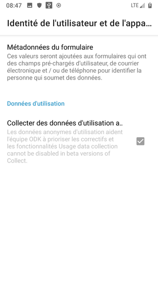
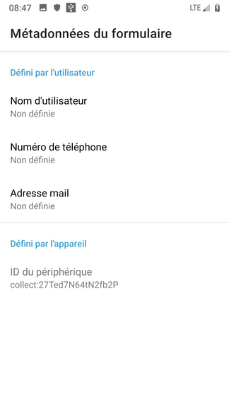
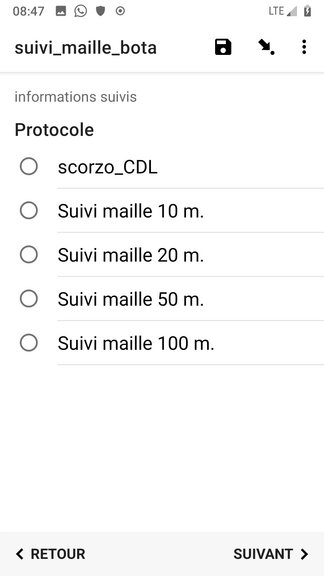
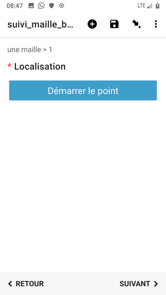
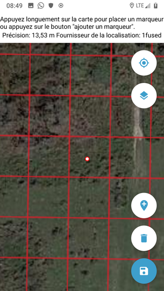
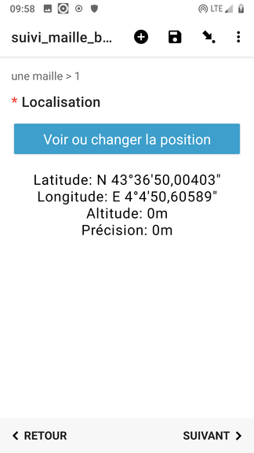
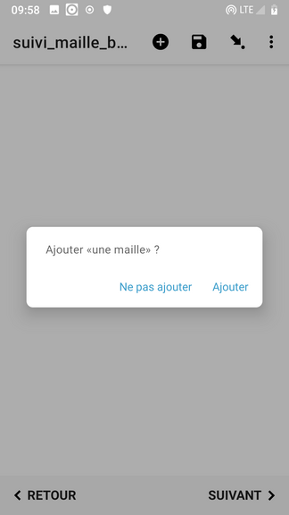
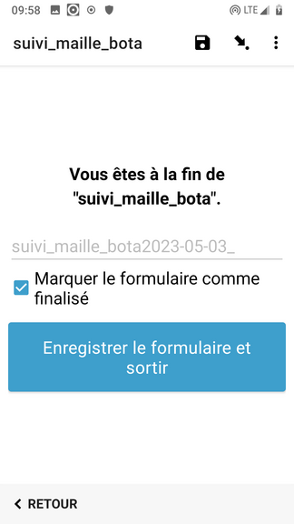

# Inventaire exhaustif par maille carrée

## Description
Parcours exhaustif d'un site (mailles carrées) et suivi de l'abondance des espèces cibles sur chacune d'entre elles.
### Auteur(s)
Formulaire développé par Mathieu Bossaert (CEN Occitanie)
### Objectif
Suivre de manière exhaustive (spatialement) l'abondance (A, B, C, D et E) d'une liste d'espèces végétale d'un site donné.
#### Protocole mis en œuvre
[version 2022](../fichiers/suivis_mailles_bota/Protocole_MAILLE_2022.pdf)
## Présentation détaillée
### Logique de collecte
### Captures d'écrans et/ou vidéo de démonstration

La taille de la maille carrée ainsi que la liste d'espèces sont définies en amont.
Le fichier "**mbtile**" contenant le fond de carte de votre site doit être placé dans le dossier suivant :
> /Android/data/org.odk.collect.android/files/layers
#### Paramétrage
##### Premier lancement d'ODK
-> Scanner le QRCode du projet en cliquant sur le bouton "_Configurer par QRCode_"

##### Accueil du projet
Voici la page d'accueil qui aparait une fois le QRCode scanné

##### Paramétrage des propriétés du projet (identité de l'utilisateur et fond de carte)
Cliquer sur le rond de couleur apparaissant en haut à droite de l'écran d'ODK pour voir apparaître cette fenêtre.

Cliquer ensuite sur "_Paramètres_"

##### Renseignement des informations sur l'utilisateur
Compléter ces information permettra de ne pas avoir à les saisir lors de l’utilisation des formulaires.
Sur l'écran précédent, cliquer sur "_Identité de l'utilisateur et de l'appareil_" pour afficher l'écran ci-dessous.

Aprés avoir chois "Métadonnées de formulaire", compléter soigneusement :
* Votre nom d'utilisateur (Prénom Nom)
* Votre adresse email professionnelle. Cette information est nécessaire pour vous attribuer correctement les données collectée.

##### Choix de l'interface cartographique
Sur l'écran des paramètres de projet, cliquer sur le bouton "_Cartes_"
Choisissez le dossier de calques contenant le fond de carte de votre site.

#### Utilisation du formulaire
##### Choix du formulaire "Suivi_maille_bota"

##### Renseignement de l'identité de l'utilisateur
Si vous avez correctement configuré les métadonnées du projet (cf plus haut) ces champs sont pré-rempli et vous pouvez passer au suivant.

##### Choisir le site suivi au cours de cette session

##### Choisir le protocole

##### Démarrer la localisation

-> ODK vous place à l'endroit du GPS

##### Afficher votre fond de carte (en lieu et place de celui par défaut
1. Cliquer sur l’icône représentant les couches
2. Choisissez votre fond de carte

3. Valider la localité

##### Renseignement de l'abondance de la ou des espèces (selon les sites)

##### Ajouter une nouvelle maille / localité ou terminer le formulaire

### Perspectives
* Disposer d'un formulaire plus générique ne générant pas autant de quesions que d'espèces suivies, pour faciliter le traitement des données collectées.
* Utiliser l'apparence **map** pour afficher et sélectionner les mailles sur la carte, et faciliter la navigation sur le site, comme on le fait dans le suivi des herbiers.

## Utiliser ce formulaire
### Licence

### XLSform
* [xlsform](../fichiers/suivis_mailles_bota/suivi_maille_bota.xlsx)
### Données externes et médias associés
-> liens vers les ressources

## Fonctionnalités de XLSForm mises en œuvre
### Discussion en ligne sur le forum d'ODK

## Traitement des données
### Scripts SQL
### Scripts R
### Autres
