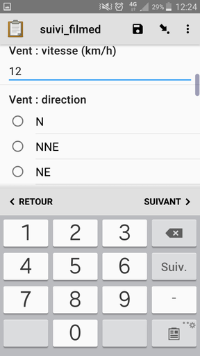
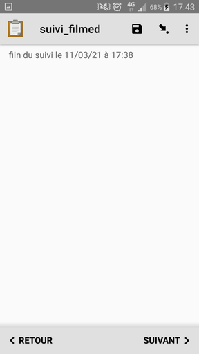

# FILMED
Suivi des paramètres physicochimiques des lagunes méditerranéeenes
## Description
### Auteurs
Développé par Mathieu BOSSAERT (CEN Occitanie) pour le [Pôle-relai Lagunes](https://pole-lagunes.org/)
### Objectif
### Protocole mis en œuvre
guide de terrain FILMED
### Logique de collecte
* Saisie optionnelle des conditions du relevé (météo)
* Pour chaque station en eau, mesure et saisie des paramètres suivants
  * Niveau ngf (cm)
  * Commentaire ngf
  * Niveau relatif (cm)
  * Conductivité (ms/cm)
  * Salinité (g/l)
  * Température (°c)
  * Ph
  * Redox (mv)
  * Oxygène dissous (mg/l)
  * Saturation en O2 (%)
  * Turbidité (cm (secchi) ou NTU)
  * Couleur de l’eau
  * Présence de macrophytes

## Captures d'écrans et démos
### Écran n°1 : identité et date

Le premier écran reprend vos informations d'identité, renseignées lors de l'initialisation de l'appareil, et vous présente la date du jour.
**L'adresse email doit bien être renseignée en minuscules (attention notamment à la première lettre que les correcteurs ont tendance à mettre en majuscule).**

### Écran n°2

Voulez vous saisir les informations relatives à la météo ?

### Renseignement des données météo du jour et de la veille

### Choix du cadre de suivi

### Choix de la lagune puis de la station

### La station est-elle en eau ?

Si oui on saisira ensuite les mesures effectuées.

Des alertes apparaissent si vous tentez de saisir des valeurs en dehors des plages de valeurs "autorisées"

### Suppression d'une valeur

Pour effacer une réponse, appuyer longtemps dessus :

Une fois renseignées les valeurs pour la station en cours, il vous sera proposé d'ajouter une nouvelle station ou non. Soit vous serez ramené au choix du cadre, soit à la fin du formulaire que vous pourrez finaliser et enregistrer.

### Revenir sur vos mesures

En cliquant sur la flèche inclinée en haut de l'écran

Vous pouvez ainsi revenir sur chacun de vos enregistrements

De même tout au long de la session vous pouvez forcer l’enregistrement des données en cours de saisie en cliquant sur la disquette de la barre d'outils.

### Envoi des données au serveur

Les versions récentes d'ODK envoient automatiquement les formulaires finalisés au serveur

### Perspectives
* Utiliser l'apparence **map** pour afficher et selectionner les stations et ouvragges sur la carte.
* Afficher la dernière valeur mesurée (entités et datasets)

## Utiliser ce formulaire
### Licence

### XLSform
* [xlsform](../fichiers/filmed/suivi_filmed.xlsx)
### Données externes et médias associés

## Fonctionnalités de XLSForm mises en oeuvre
### Discussion en ligne sur le forum d'ODK
* calcul de la côte prévue dans le plan de gestion : https://forum.getodk.org/t/indexed-repeat-error-is-there-a-maximum-length-for-a-statement-in-xlsform-cells/34571
* afficher la station selectionnée sur la carte et confirmer que c'est bien celle à côté de laquelle nous nous trouvons : https://forum.getodk.org/t/default-geopoint-using-select-one-and-calculate/34910/4?u=mathieubossaert
-> à remlplacer par un select_one avec une apparence de carte (map)
## Traitement des données
### Scripts SQL
### Scripts R
### Autres