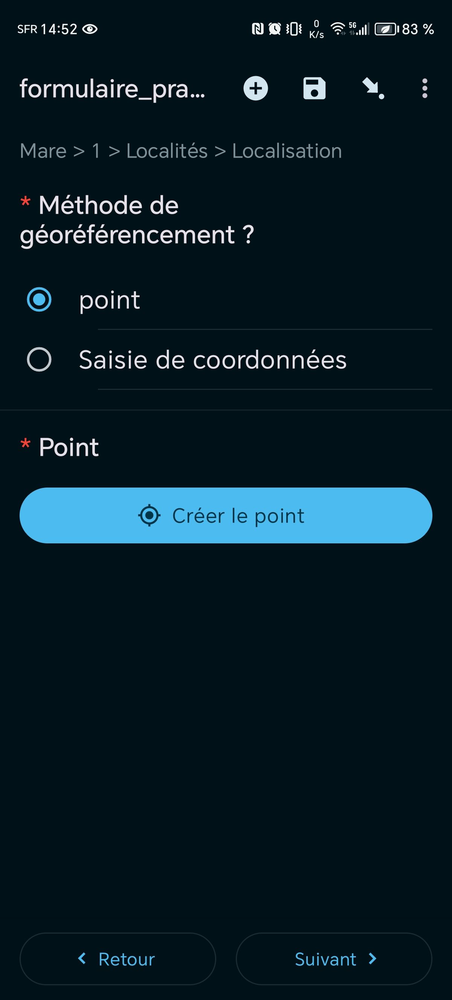

# Formulaire PRAM simplifié

## Description

### Auteur(s)
Maxime Olivo - technicien en géomatique au CEN Occitanie

### Objectif
Dans le cadre du projet PRAM, et suite à la diffusion d'un premier formulaire de saisie de donnée plus complet, le CEN Occitanie a décidé de mettre en place un second formulaire simplifié à destination du grand public. Ce formulaire permet de saisir des fiches descriptives de mares, via web ou mobile (ODK), de manière plus rapide tout en gardant les informations élémentaires liées à l'habitat "mare". Ces fiches seront ensuite consultables depuis l’[application web](https://pram.cen-occitanie.org/#/) du PRAM Occitanie.

### Protocole
Le CEN Occitanie a mis en place une [fiche de caractérisation des mares](https://www.pram-occitanie.fr/Fiche-de-caracterisation-de-mare) spécifique à la version simplifié du formulaire standard.

## Présentation détaillée

### Logique de collecte
- Sélection de la date de saisie et structure 
- Géolocalisation de la mare
- Sélection du type de foncier 
- Description du contexte général de la mare
- Sélection de la nature du fond
- Sélection de la pente
- Sélection du stade d'évolution
- Sélection de la superficie en m²
- Sélection de la transparence de l'eau
- Caractérisation des pressions et menaces
- Sélection du pourcentage de fermeture de la mare
- Sélection du type d'accessibilité de la mare
- Photographie(s) de la mare et commentaire général
- Saisie d'observation naturaliste
    - Faune / Flore / Fonge / Habitat

## Captures d'écran de démonstration :

### Écran n°1 : Page d'accueil

### Écran n°2 : Données générales              
Vous devez renseigner : le nom de l'utilisateur et l'adresse mail* correspondante, puis sélectionner la date de saisie du formulaire.

* Attention à l'initialisation automatique de la première lettre tapée, celle-ci doit être en minuscule pour éviter au plus les doublons en base.

### Écran n°3 : Structure de l'utilisateur

### Écran n°4 : Structure (Autre)
Si vous cochez *"autre"*, vous serez rediriger sur une autre page pour indiquer la structure correspondante.

### Écran n°5 : Méthode de géoréférencement
Vous avez le choix parmi deux méthodes : le point automatique sur un fond de carte, ou la saisie manuelle des coordonnées GPS de la mare.

### Écran n°6 : Foncier
Vous devez sélectionner le type de foncier du terrain sur lequel se trouve la mare (4 options, choix unique et réponse obligatoire).

### Écran n°7 : Contexte général
Vous devez sélectionner le contexte environnemental de la mare (6 options, 2 choix maximum et réponse obligatoire), l'option 'Autre' est à renseigner manuellement.

### Écran n°8 : Nature du fond
Vous devez sélectionner la nature du fond de la mare (7 options, 2 choix maximum et réponse obligatoire), les options 'Autre(s) matériau(x) naturel(s)' et 'Autre' sont à renseigner manuellement.
'

### Écran n°9 : Pourcentage des pentes douces des berges
Vous devez sélectionner la proportion (en %) de berges en pente douce (5 options, choix unique et réponse obligatoire).

### Écran n°10 : Stades d'évolution
Vous devez sélectionner le stade de développement de la mare (4 options, choix unique et réponse obligatoire).

### Écran n°11 : Superficie
Vous devez sélectionner la superficie (réponses classées par intervalles de grandeur) de la mare (8 options, choix unique et réponse obligatoire).

### Écran n°12 : Transparence de l'eau
Vous devez sélectionner l'état de transparence de la mare, en fonction de l'état de visibilité du fond (3 options, choix unique et réponse obligatoire).

### Écran n°13 : Pressions et menaces
Vous devez sélectionner un ou plusieurs facteur(s) de pressions sur la mare (14 options, choix multiples non limités et réponse obligatoire), l'option 'Autre' est à renseigner manuellement.

### Écran n°14 : Fermeture de la mare
Vous devez sélectionner le pourcentage de fermeture de la mare (5 options, choix unique et réponse obligatoire).

### Écran n°15 : Type(s) d'accessibilité de la mare
Vous devez sélectionner un ou plusieurs moyen(s) d'accéder à la mare (6 options, choix multiples non limités et réponse obligatoire)

### Écran n°16 : Photo
Vous devez prendre un ou plusieurs cliché(s) de la mare, soit par prise de photo "en direct", soit par chargement d'image(s) déjà existante(s). Il est possible de rajouter des éléments graphiques sur les images avec "écrire sur l'image" (en grisé sur la capture d'écran).

### Écran n°17 : Remarques générales
Vous avez la possiblité d'ajouter un commentaire sur la mare décrite.

### Écran n°18 : Ajout d'une observation
Vous avez la possiblité d'ajouter une observation naturaliste en complément de la mare (sous la forme de mention d'espèce seulement), parmi les groupes taxonomiques suivants : Plante / Animal / Champignon et lichens / Habitat.

### Écran n°20 : Recherche du nom de l'espèce
En fonction du groupe choisi à l'étape précedente, vous devez sélectionner un taxon parmi la liste déroulante (une barre de recherche vous aide à filtrer les noms). La liste utilisée est empruntée à Taxref version 16.

Après cette étape, vous avez le choix de saisir une autre observation, ou de passer l'étape et conclure le formulaire.

## Utiliser ce formulaire

### Licence

### XLSform
[formulaire_pram_simplifiee.xlsx](../fichiers/PRAM_simplifie/formulaire_pram_simplifie.xlsx) (version 2.2 - dernière mise à jour : 18/12/2024)

### QRcode

### Données externes et médias associés
Fiche de caractérisation des mares (version simplifiée) : https://www.pram-occitanie.fr/Fiche-de-caracterisation-de-mare
Visualisation des données sur l'application cartographique du PRAM Occitanie : https://pram.cen-occitanie.org/#/

## Fonctionnalités à venir
- Ajout d'une liste d'entités pour faciliter la saisie et l'étendre à d'autres formulaires du CEN Occitanie (SICEN)

## Traitement des données

### Scripts SQL
Script d'alimentation du référentiel régional depuis les nouvelles données saisies via le formulaire : 
[traitements_bdd_formulaire_pram_simplifie.sql](../fichiers/PRAM_simplifie/traitements_bdd_formulaire_pram_simplifie.sql)