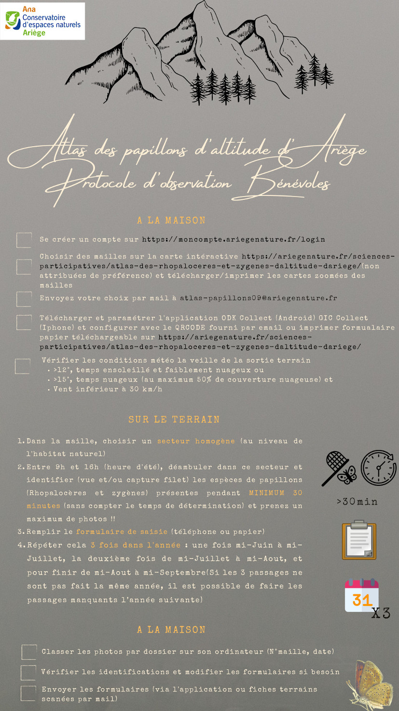

# Atlas des rhopalocères et zygènes d’altitude d’Ariège (formulaire bénévole)
Améliorer les connaissances sur la répartition des espèces et des cortèges d’espèces d’altitude...
## Description
### Auteur(s)

-> formulaire développé par Yann Voté, Alexis Heras et Cédric Roy à l’ANA-CEN Ariège 

### Objectif 

Les objectifs principaux de cet atlas sont : 
* l’amélioration des connaissances sur la répartition des espèces et des cortèges d’espèces d’altitude susceptibles d’être affectées par le changement climatique et par les modifications des pratiques agricoles et d’autres éventuels facteurs d’influence (fréquentation etc). 
* La sensibilisation du grand public et des professionnels à cette thématique 

#### Protocole mis en œuvre  

Le protocole d’inventaire est détaillé [ici](../fichiers/arzaa_formbenevole/Protocole-benevole-atlas-papillons-montagne-1.pdf)

## Présentation détaillée 

### Logique de collecte 

* Localisation d’un point  
* Photo du milieu 
* Saisie des paramètres externes (température, hygrométrie, couverture nuageuse, vitesse et direction du vent, pluie) 
* Heure de début du relevé 
* Saisie des taxons de papillons de jour et de zygènes avec comportement, sexe et dénombrement précis 
* Photos des taxons 

### Captures d’écrans et/ou vidéo de démonstration 

Voir le guide d’utilisation du formulaire ([https://ariegenature.fr/wp-content/uploads/2022/07/Guide-utilisation-formulaire.pdf](https://ariegenature.fr/wp-content/uploads/2022/07/Guide-utilisation-formulaire.pdf)) 

### Utiliser ce formulaire 
Toutes les ressources sont disponibles ici : 
* [https://ariegenature.fr/sciences-participatives/atlas-des-rhopaloceres-et-zygenes-daltitude-dariege/](https://ariegenature.fr/sciences-participatives/atlas-des-rhopaloceres-et-zygenes-daltitude-dariege/) 
* notamment le guide d’installation et de première utilisation de l’application ODK Collect ([Guide-premiere-utilisation-ODK.pdf](../fichiers/arzaa_formbenevole/Guide-premiere-utilisation-ODK.pdf)) 
* et le guide d’utilisation du formulaire ([../fichiers/arzaa_formbenevole/Guide-utilisation-formulaire.pdf)) 
### Licence

### XLSform
[télécharger le formuliare](../fichiers/arzaa_formbenevole/atlas_papillons_altitude_formulaire_benevole.xlsx)
### Données externes et médias associés 

[CSV et images](../fichiers/arzaa_formbenevole/medias_et_csv.zip) 

## Fonctionnalités de XLSForm mises en œuvre 

* select_one_from_file 
* select_one 
* select_multiple