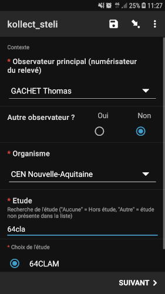
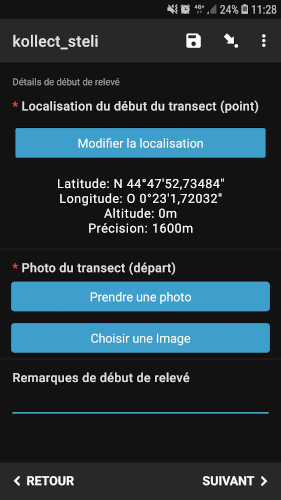
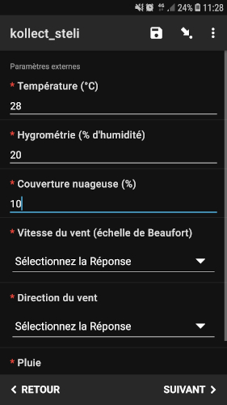
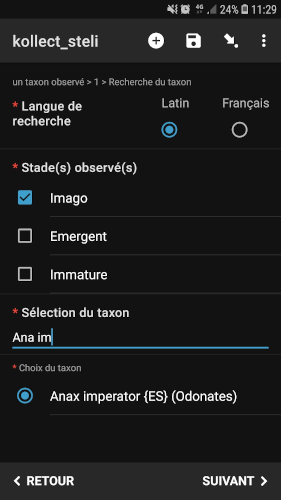
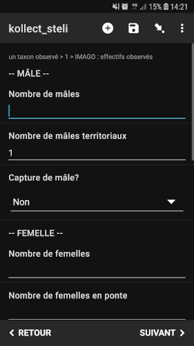
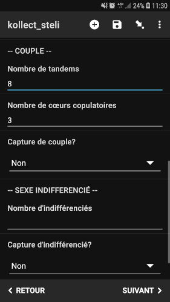
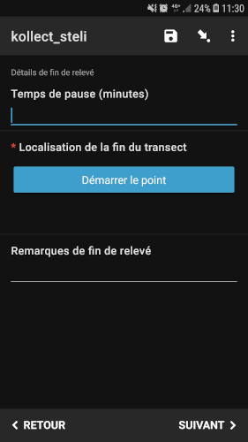

# Kollect STELI (Suivi Temporel des Libellules)

## Description
### Auteur(s)
Thomas GACHET (CEN Nouvelle-Aquitaine)

:::note Objectif
Ce formulaire permet la saisie sur le terrain de toutes les informations nécessaires à la bonne application du **protocole STELI** pour intégration dans Kollect.
:::

:::info Prérequis
Le transect doit être créé dans **Kollect** en amont pour que le rattachement soit automatique via la prise du point au début et à la fin du formulaire.
L'utilisateur doit être inscrit à Kollect et avoir reçu son **QRCode ODK personnel** (pour récupération automatique de l'identité de l'observateur principal).
:::
### Objectif
#### Protocole mis en œuvre
Suivi Temporel des Libellules ([STELI](https://steli.mnhn.fr/))

## Présentation détaillée
### Logique de collecte
* Un formulaire est utilisé pour un seul relevé STELI sur un transect.
* Il n'y a qu'une seule boucle qui permet d'ajouter plusieurs taxons pour le relevé.

### Captures d'écrans et/ou vidéo de démonstration

#### 1 : identité

* Identification de l'observateur principal et des éventuels autres observateur. 
* Sélection de l'organisme rattaché à l'observateur principal puis de l'étude rattachée à l'organisme (listes de rattachement gérées depuis Kollect et intégrées dans ODK via des _.csv_ exportés depuis la base de données).

#### 2 : localisation du départ

* Localisation du début du transect (point).
* Prise d'une photo du début de transect.

#### 3 : paramètres météorologiques

* Saisie des paramètres météorologiques (température, hygrométrie, couverture nuageuse, vitesse et direction du vent, pluie).

#### 4 : sélection du taxon observé et choix du/des stade(s)

* Recherche dynamique par nom latin ou français et possibilité de sélectionner des groupes et/ou complexes d'espèces. 
* En nom latin, possibilité de saisir les 3 premières lettres du genre suivi d'un espace pour aller plus vite dans la recherche.
* Possibilité de sélectionner des groupes et complexes d'espèces.

 
#### 5 : détails de l'observation

* Saisie rapide des dénombrements selon le sexe et les comportements observés sur le terrain.

#### 6 : localisation de l'arrivée
 
* Localisation de la fin du transect (point) pour rattachement automatique au transect dans Kollect (requête spatiale d'intersection à l'intégration entre le transect présent dans Kollect et la polyligne créée à la volée grâce aux localisation de début et de fin).
* Possibilité de noter un temps de pause en minutes.
* Remarques éventuelles sur le relevé.

### Perspectives

## Utiliser ce formulaire
### Licence 
)

### Perspectives
:::tip Mises à jour prévues
* Sélection directement sur une carte du transect à parcourir (si le transect n'est pas présent, possibilité de le créer dynamiquement via les points de début et de fin pour modification dans Kollect)
:::

### XLSform
à venir
### Données externes et médias associés

## Fonctionnalités de XLSForm mises en oeuvre
### Discussion en ligne sur le forum d'ODK

## Traitement des données
### Scripts SQL
### Scripts R
### Autres