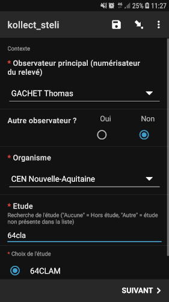

# Kollect STELI (Suivi Temporel des Libellules)

:::note remarque

Ce formulaire permet la saisie sur le terrain de toutes les informations nécessaires à la bonne application du protocole STELI pour intégration dans Kollect.

:::

:::info Prérequis

Le transect doit être créé dans Kollect en amont pour que le rattachement soit automatique via la prise du point au début et à la fin du formulaire.
L'utilisateur doit être inscrit à Kollect et avoir reçu son QR Code ODK personnel (pour récupération automatique de l'identité de l'observateur principal).

:::

## Logique du formulaire

Ecran 1 : identité

Identification de l'observateur principal et des éventuels autres observateur. Sélection de l'organisme rattaché à l'observateur principal puis de    l'étude rattachée à l'organisme (listes de rattachement gérées depuis Kollect et intégrées dans ODK via de csv exportés depuis la base de données).
 

 

* Localisation du début de transect pour rattachement automatique au transect dans Kollect (reqûête spatiale d'intersection à l'intégration)

* Photo du début du transect

* Saisie des paramètres externes (température, hygrométrie, couverture nuageuse, vitesse et direction du vent, pluie)

* Heure de début du relevé

* Saisie des taxons d'odonates : choix du/des stade(s) avec comportement, sexe et dénombrement précis. Recherche par nom latin ou français et possibilité de sélectionner des groupes et/ou complexes d'espèces.

* Heure de fin de relevé

* Possibilité de noter un temps de pause en minutes

* Localisation de la fin du transect

* Remarques éventuelles sur le relevé

## Ressources
