# Suivis Amphibiens "OSU OREME"
## &#128056;
## Description
### Auteur(s)
Mathieu BOSSAERT (Cen Occitanie) 
### Objectif
#### Protocole mis en oeuvre
* [Protocole](../fichiers/mare_amphibiens_OSU_OREME/Programme_mare_amphibiens_OSU_OREME_1.pdf)
-> lien vers le pdf ou autre ressource
## Présentation détaillée
### Logique de collecte

* Selection de la mare 
* Description de la mare
* Métadonnées de la session (date, observateurs...)
* Dénombrement précis pour les taxons suivants :
  * Triturus marmoratus
  * Lissotriton helveticus
  * Salamandra salamandra
  * Bufo spinosus
  * Epidalea calamita
  * Bufo/Epidalea
  * Alytes obstetricans
  * Discoglossus pictus
  * Pelodytes punctatus
  * Pelobates cultripes
  * Hyla meridionalis
  * Pelophylax sp.

## Captures d'écrans
### Ecran n° 1 : introduction 

### Ecran n° 2 : "message de service"
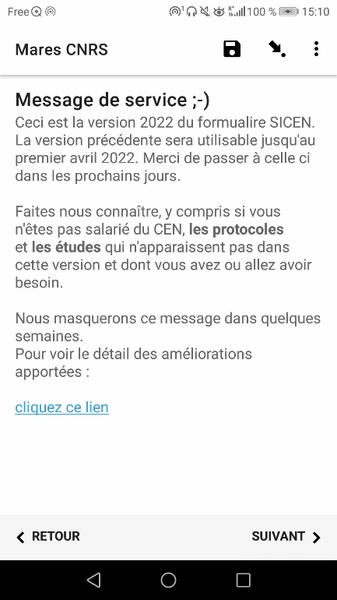
### Ecran n° 3 : identité de l'utilisateur 

### Ecran n° 4 : date et heure du relevé
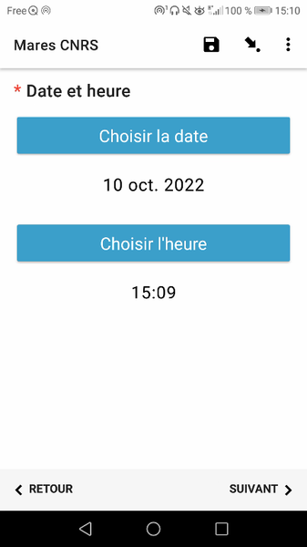
### Ecran n° 5 : localisation de la mare 
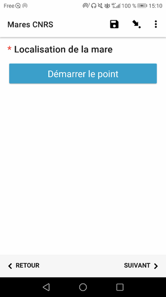
### Ecran n° 6 : activation du GPS (si nécessaire) 
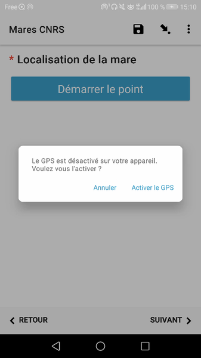
### Ecran n° 7 : enregistrement de la localité
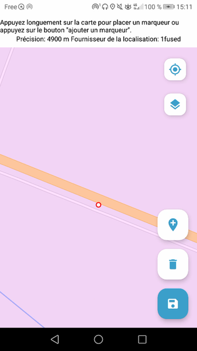
### Ecran n° 8 : coordonnées enregistrées
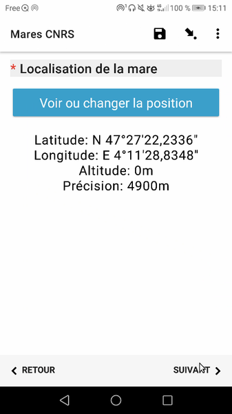
### Ecran n° 9 : nom du site / numéro de la mare

### Ecran n° 10 : milieu environnant
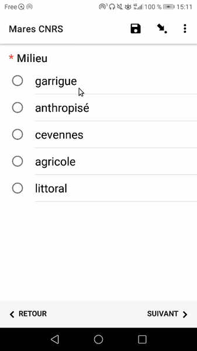
### Ecran n° 11 : numéro du passage 

### Ecran n° 12 : type de prospection (diurne / nocturne) 
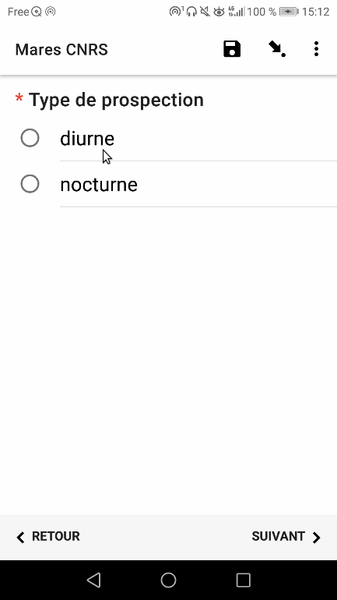
### Ecran n° 13 : durée de la prospection
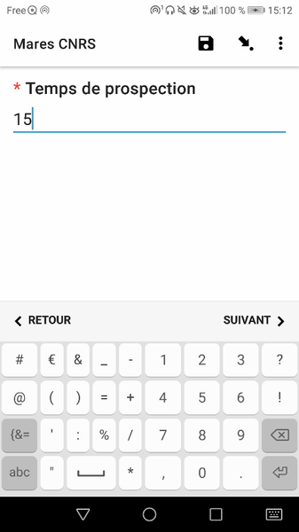
### Ecran n° 14 : typologie de la mare 
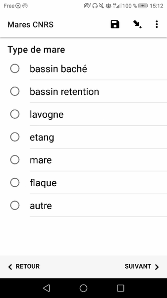
### Ecran n° 15 : régime hydrologique (permanente / temporaire)

### Ecran n° 16 : survenue d'assec ?
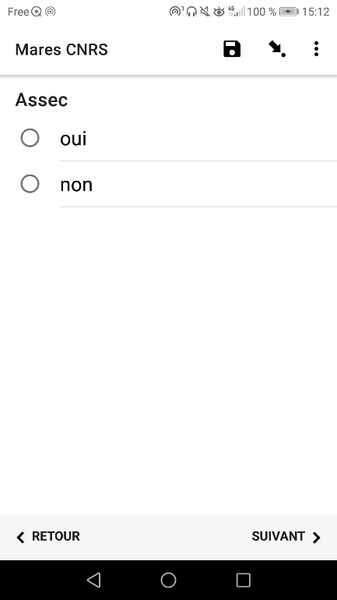
### Ecran n° 17 : hauteur de la lame d'eau
 
### Ecran n° 18 : présence de poissons 
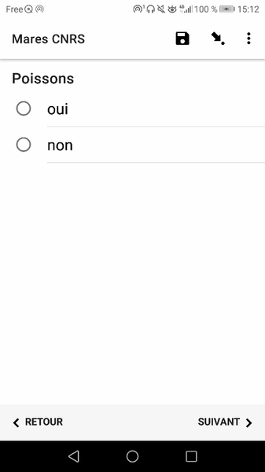
### Ecran n° 19 : espèces le cas échéant (sinon écran masqué) 
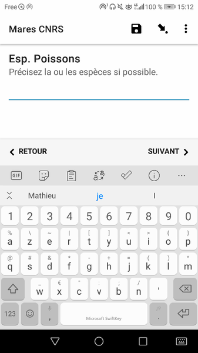
### Ecran n° 20 : présence d'écrevisses
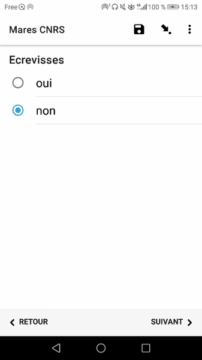
### Ecran n° 21 : espèces le cas échéant (sinon écran masqué) 
  
### Ecran n° 22 ; choix de l'espèce d'amphibien comptée
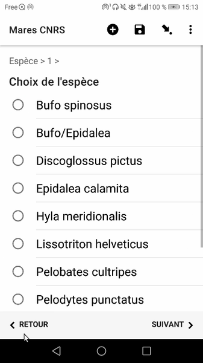
### Ecran n° 23 : effectif d'individus adultes 

### Ecran n° 24 : "état" des adultes
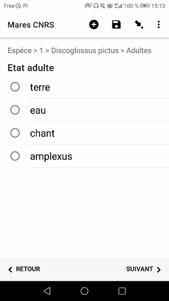
### Ecran n° 25 : effectif d'individus juvéniles
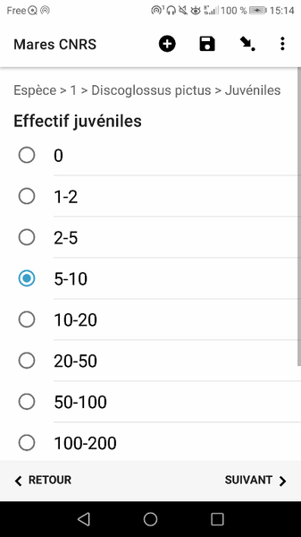
### Ecran n° 26 : "état" des juvéniles 
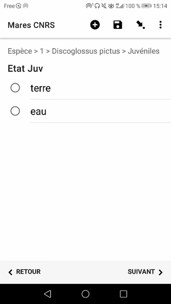
### Ecran n° 27 : effectif des pontes 

### Ecran n° 28 : "état" des pontes

### Ecran n° 29 : effectif des larves
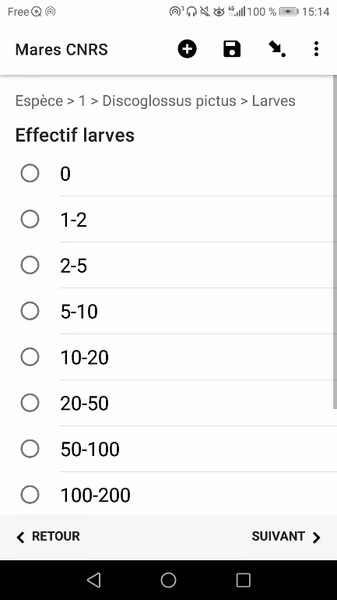
### Ecran n° 30 : "état" des larves
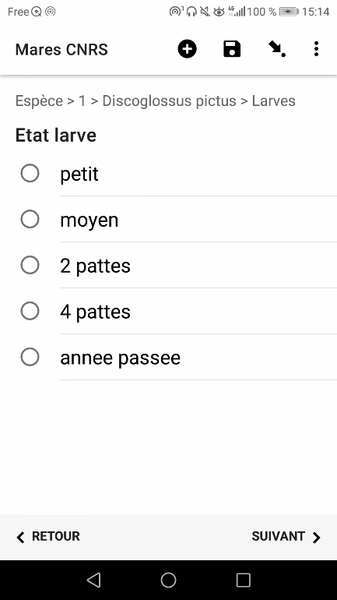
### Ecran n° 31 : comptage d'une autre espèces ? 
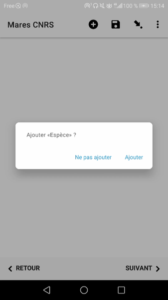

### Utiliser ce formulaire
#### XLSform
* [xlsform](../fichiers/mare_amphibiens_OSU_OREME/MaresCNRS.xlsx)
#### Données externes et médias associés
-> liens vers les ressources