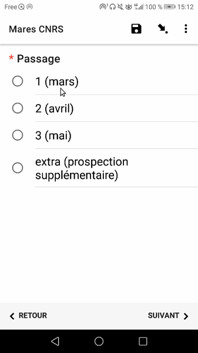

# Suivis Amphibiens "OSU OREME"
## Description
### Auteur(s)
Mathieu BOSSAERT (Cen Occitanie) 
### Objectif
#### Protocole mis en oeuvre
-> lien vers le pdf ou autre ressource
## Présentation détaillée
### Logique de collecte

* Selection de la mare 
* Description de la mare
* Métadonnées de la session (date, observateurs...)
* Dénombrement précis pour les taxons suivants :
  * Triturus marmoratus
  * Lissotriton helveticus
  * Salamandra salamandra
  * Bufo spinosus
  * Epidalea calamita
  * Bufo/Epidalea
  * Alytes obstetricans
  * Discoglossus pictus
  * Pelodytes punctatus
  * Pelobates cultripes
  * Hyla meridionalis
  * Pelophylax sp.

## Ressources

* 
* [Protocole](../fichiers/Mare_OSU_OREME/Programme_Mare_OSU_OREME_1.pdf)

## Captures d'écrans
### Ecran n° : 

### Ecran n° : 

### Ecran n° : 

### Ecran n° : 

### Ecran n° : 

### Ecran n° : 

### Ecran n° : 

### Ecran n° : 

### Ecran n° : 

### Ecran n° : 

### Ecran n° : 

### Ecran n° : 

### Ecran n° : 

### Ecran n° : 

### Ecran n° : 

### Ecran n° : 

### Ecran n° : 

### Ecran n° : 

### Ecran n° : 

### Ecran n° : 

### Ecran n° : 

### Ecran n° : 

### Ecran n° : 

### Ecran n° : 

### Ecran n° : 

### Ecran n° : 

### Ecran n° : 

### Ecran n° : 

### Ecran n° : 

### Ecran n° : 

### Ecran n° : 

### Ecran n° : 

### Ecran n° : 

### Ecran n° : 

### Utiliser ce formulaire
#### XLSform
-> lien vers le fichier
#### Données externes et médias associés
-> liens vers les ressources