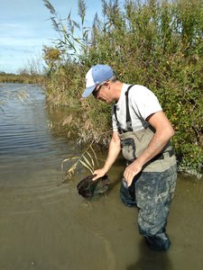

# CMR Pose / géoréférencement des pièges
## Description
### Auteur(s)
Mathieu Bossaert, CEN Occitanie
### Objectif

Géoréférencer et numéroter les pièges utilisés pour les capturese de cistude. Ce formulaire, utilisé le premier jour, permettra de mettre à jour le référentiel des pièges utilisé dans le [formulaire de CMR](cmr_tortues.md)
#### Protocole mis en œuvre

## Présentation détaillée
### Logique de collecte
### Captures d'écrans et/ou vidéo de démonstration

## Utiliser ce formulaire
### Licence
)
### XLSform
-> lien vers le fichier
### Données externes et médias associés
-> liens vers les ressources

## Fonctionnalités de XLSForm mises en oeuvre
### Discussion en ligne sur le forum d'ODK

## Traitement des données
### Scripts SQL
### Scripts R
### Autres
