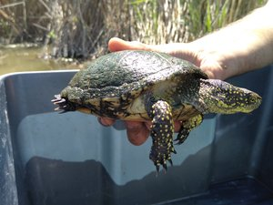
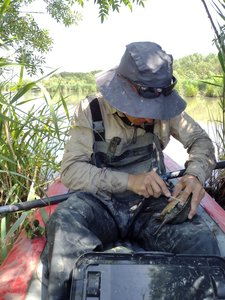

# Capture, Marquage, Recapture de cistude et d'émyde lépreuse

## Auteur(s)
-> Vivian Inereli & Mathieu Bossaert, CEN Occitanie
# Présentation détaillée
Ce formulaire a pour but de remplacer les fiches d'identification et de biométrie des tortues capturées sur le terrain.
## Logique de collecte
* renseignement de l'utilisateur
* renseignement de la date et de l'heure
* type de capture/piège (Nasse, verveux ou cpature incidente)
* est-ce une première capture ou une recapture ?
  * si recapture :
    * quel est le numéro porté par la tortue (issu de la somme des valeurs des écailles marquées)
    * quel est le piège ?
  * pointage des écailles sur la carapace pour vérification (dessin svg) par somme des écailles et comparaison avec la valeur renseignée juste avant
   -> alerte si incohérence entre les deux valeurs
  * possibilité de visualiser la photo de la dossière de cette tortue (banque d'images en ligne)
* sexage (mâle / femelle / immature)
  * si femelle :
    * présence d'oeufs : oui / non
* mesures biométrique
  * poids
  * longueur de la dossière
  * longueur du plastron
* prise ou chargement de photo (annotation possible)
  * de la dossière
  * du plastron
* Ajout d'une nouvelle tortue : oui / non

## Captures d'écrans et démos
<video controls>
  <source src="/demo_formulaire_cistude.webm"/>
</video>
## Utiliser ce formulaire
## XLSform
* [xlsform](../fichiers/cmr_cistude_emyde/CMR_Cistude_captures.xlsx)
## Données externes et médias associés
* [dessin svg de la dossière de cistude](../fichiers/cmr_cistude_emyde/cistude_dossiere_etiquette.svg)
* [emplacement des pièges (dégradé)](../fichiers/cmr_cistude_emyde/pieges.geojson)
* [logo du cen](../fichiers/cmr_cistude_emyde/logo_cen.jpg)
# Fonctionnalités de XLSForm mises en œuvre
* [Sélection multiple sur dessin svg](https://docs.getodk.org/form-question-types/#select-from-image-widget) (carapace de la tortue) pour pointer les écailles marquées.
* [lien web / url](https://docs.getodk.org/form-question-types/#url-widget) : chargement de photos relatives à l'individu capturée
## Discussion en lien sur le forum d'ODK
[mise à jour des medias externes depuis les données d'un autre formulaire (pose de pièges)](https://forum.getodk.org/t/updating-external-datasets-from-another-forms-submissions-data-from-within-a-postgresql-database/37596)

:::note crédits photos
de haut en bas : Célia Grillas, Florian Larnaudie
:::