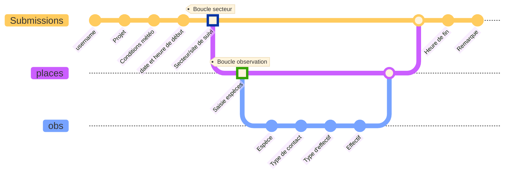

# Suivis Amphibiens "OOiseaux d'eau"
## Description
### Auteur(s)
Formulaire développé par Nathalie Hiessler (Cen Occitanie) 
### Objectif
`
l’herpétofaune française à partir de l’estimation de l’occurrence des communautés
d’amphibiens dans les sites aquatiques.
```
#### Protocole mis en œuvre
* [Protocole](../fichiers/POPAmhibienCommunaute/Protocole_POPAmphibien_Communaute_2022.pdf)
## Présentation détaillée
### Logique de collecte

#### 1- Information générales
* **Utilisateur:** courriel et nom de l'observateur, automatisable dans les paramètres d'ODK Collect sur le téléphone
* **Identifiant du projet :** code interne à la structure

#### 2- Conditions de prospection
* **Météo:** conditions de température, vent et nébulosité
* **Heure de début** du relevé

#### 3- Boucles de saisie des effectifs par secteur, espèce, type de contact
* **Boucle 1:** saisie de l'identifiant du secteur de suivi
    * **Boucle 2:** Saisie des espèces et effectifs
        * Espèce
        * Type de contact
        * Type d'effectif
        * une question "effectif" par type d'effectif
    ***Fin de la boucle saisie des espèces***
***Fin de la boucle de renseignement des secteurs***

#### Fin du formulaire
* **Heure de fin** du relevé
* Remarques

## Captures d'écrans

### Utiliser ce formulaire
#### XLSform
* [xlsform](../fichiers/oiseaux_eau/oiseaux_eau.xlsx)
#### Données externes et médias associés
-> liens vers les ressources