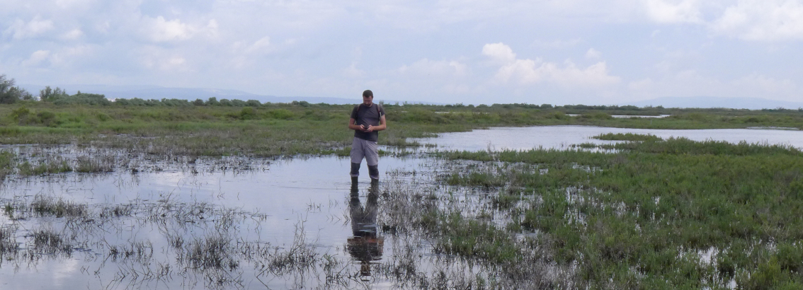

:::info Avertissement
Ce site et son dépôt Git associé sont une initiative de géomaticiens du [réseau des Conservatoires d'Espaces Naturels](https://reseau-cen.org/).

Il promeut ODK pour la mise en œuvre des formulaires qui y sont présentés et partagés mais est totalement indépendant du projet ODK.
Les formulaires proposés ici sont mis en œuvre par des utilisateurs de la solution et non pas par l'équipe d'ODK.
:::
## Vitrine des formulaires XLSForm mis en œuvre pour la conservation de la nature

A l'initiative des Conservatoires d'Espaces Naturels, cet espace est un endroit dédié à la présentation et au partage des formulaires mis en place pour collecter des données dans le réseau des CEN.
Le but étant de ne pas repartir de 0 dans le développement d'un formulaire ou d'une application mobile pour mettre en œuvre un nouveau suivi ou une nouvelle collecte de données mais plutôt de favoriser l'utilisation d'ODK, développé pour cela, et la réutilisation ou l'adaptation de formulaires XLSForm existants.

Le standard XLSForm s'y prête bien. Il permet en effet de copier/coller des blocs de questions d'un formulaire à un autre. Cela sera facilité en essayant de standardiser l'ordre des colonnes du fichier XLSForm.
Un [modèle](./ODK-CEN/fichiers/template.xlsx) est proposé à cet effet, nous nous efforcerons de le respecter. A défaut il est bien sûr possible de réordonner les colonnes avant de copier,coller le bloc de questions.

Ces formulaires, les ressources qu'ils utilisent (référentiels, images...) ainsi que les protocoles auxquels ils sont associés seront téléchargeables.

:::info
Les descriptions de formulaires sont en cours de rédaction et nous allons tâcher de les illustrer le mieux possible
:::

## [-> Voir les formulaires <-](./category/les-formulaires)

:::info Crédit photo 
Mario Klesczewski
:::
