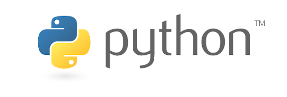

# pyODK
> C'est un client pour l'API d'ODK Central. Utilisez-le pour interagir avec vos données et automatiser des tâches courantes avec Python.
> 
> Cette bibliothèque vise à simplifier au maximum les tâches courantes d'analyse des données et d'automatisation des flux de travail en fournissant des noms de méthodes, des types et des exemples > clairs.
> Elle fournit également un accès pratique à l'API complète à l'aide de méthodes verbales HTTP.

Le webinaire d'Hélène Martin :

<iframe width="800" height="600" src="https://www.youtube.com/embed/sIaquyz5bP8" title="Automating data analysis and workflows with pyODK" frameborder="0" allow="accelerometer; autoplay; clipboard-write; encrypted-media; gyroscope; picture-in-picture" allowfullscreen></iframe>

Le dépôt Github est ici : https://github.com/getodk/pyodk
