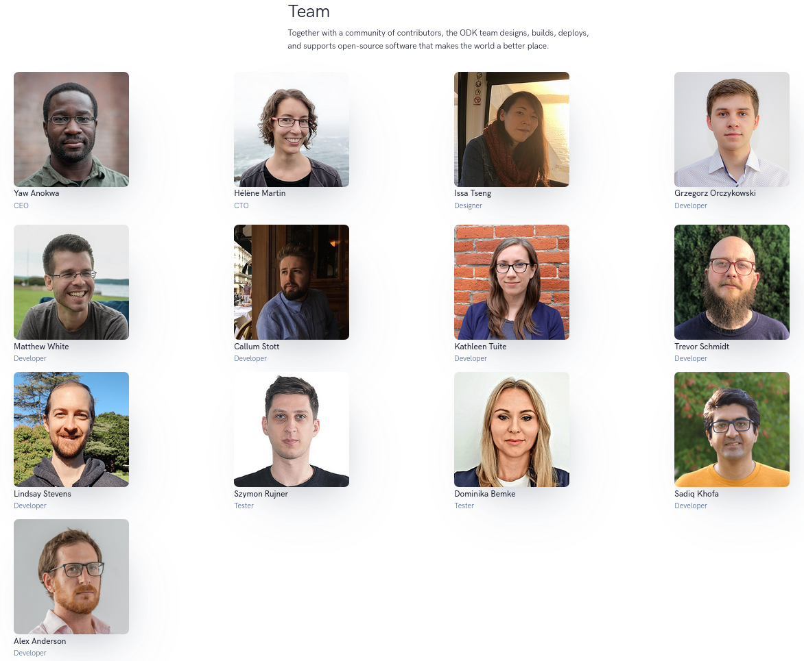

# ODK - Open Data Kit

Exemple de l'importance d'ODK dans la collecte de données au CEN Occitanie
<iframe src="https://dashboards.cen-occitanie.org/embed/query/150/visualization/490?api_key=k6q0e0T0CPfE2ceVJz4uaaCfapg4VHio2dTlmsoK&" width="720" height="500"></iframe>

## Présentation de l'outil

## Présentation de l'équipe

## Quelques présentations réalisées au sujet d'ODK au CEN

* https://static.geotribu.fr/articles/2021/2021-06-08_odk_postgis_1/
* https://si.cen-occitanie.org/opendatakit_au_foss4g-fr_2018/
* https://si.cen-occitanie.org/wp-content/uploads/2022/06/CEN_Occitanie_SI_PostGIS_ODK.pdf

## ODK au sein du SI
