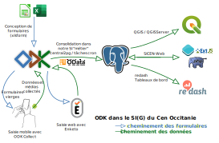

:::info Avertissement
Ce site et le dépot GIT associé sont une initiative de géomaticiens du réseau des Conservatoires d'Espaces Naturels.
Il promeut ODK pour le mise en oeuvre des formulaires qui y sont présentés et partagés mais est totalement indépendant du projet ODK.
Les formualires proposés ici sont mis en oeuvre par des utilisateurs de la solution et en rien par l'équipe de GetODK
:::

# ODK - Open Data Kit

## Présentation de l'outil
### La norme pour la collecte de données mobiles
* Créez des formulaires puissants
* Collectez des données hors ligne
* Analysez en toute simplicité
* Eprouvé dans tous les secteurs
* Éprouvé à l'échelle mondiale
* Open source

Plus d'informations sur le [site de la solution](https://getodk.org)

## Quelques présentations réalisées au sujet d'ODK au CEN

* https://static.geotribu.fr/articles/2021/2021-06-08_odk_postgis_1/
* https://si.cen-occitanie.org/opendatakit_au_foss4g-fr_2018/
* https://si.cen-occitanie.org/wp-content/uploads/2022/06/CEN_Occitanie_SI_PostGIS_ODK.pdf

## ODK au sein du SI

Exemple de l'importance d'ODK dans la collecte de données au CEN Occitanie
<iframe src="https://dashboards.cen-occitanie.org/embed/query/150/visualization/490?api_key=k6q0e0T0CPfE2ceVJz4uaaCfapg4VHio2dTlmsoK&" width="720" height="500"></iframe>
